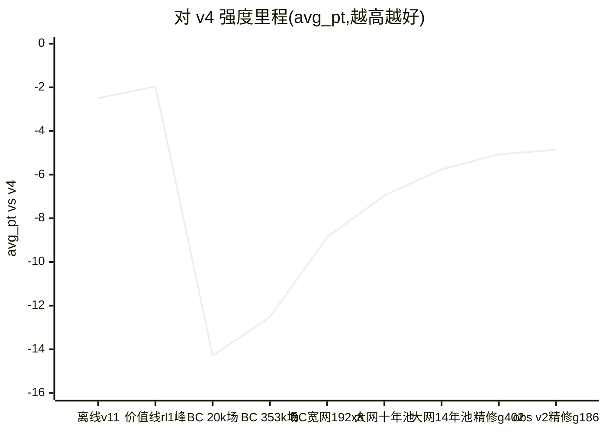
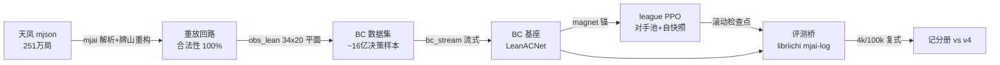

# TanyaoDojo

**JAX 全 GPU 向量化的麻将 AI 训练场**:行为克隆 + 自博弈强化学习全栈,
每一步强度都用**复式 1v3 对抗**量化到小数点后两位。

当前基准对手是开源最强之一的 **Mortal v4**(256ch×54blk,23.8M 参数),目标是稳定超越;
同时孵化川麻纯 RL 线。评测桥依赖上游 [Mortal](https://github.com/Equim-chan/Mortal)
的 libriichi(AGPL-3.0,不随本仓库分发,见 [SETUP.md](SETUP.md))。

> **许可**:根目录 MIT,`jax_rl/mjai_bot/` 为 AGPL-3.0(链接 libriichi)——见 [LICENSING.md](LICENSING.md)。
> **数据**:天凤牌谱及其派生数据集**不分发**,请自备牌谱按 SETUP.md 重建。

- **数据**:天凤凤凰卓 16 年牌谱(251 万局 mjai 格式;受天凤条款约束不入库、不再分发)
- **评测协议(神圣不可变)**:复式 1v3,challenger 轮换 4 座打同一批牌山,
  seed_key=20260711,pt=[90,45,0,-135],champion=mortal_v4。
  分层:400 局=冒烟(±8.5)/ 4k 局=选型(±2.7)/ **100k 局=里程碑(±0.55,CI>0 = 真超 v4)**。

## 现状(2026-08-20)

两代技术栈,一条记分册:

| 线 | 状态 | 最优 | 备注 |
|---|---|---|---|
| **价值线**(Mortal 栈,DQN 式在线值回归) | 已退役 | **-1.96 ± 0.53**(100k) | 首破离线天花板 -2.50;anchor 守稳不涨后关线 |
| **Mahjax 线**(JAX 全 GPU 向量化,当前主线) | 进行中 | **-4.86 ± 1.54**(12k) | BC 三杠杆全部见底(平台 ≈ -5);已转入 oracle critic RL |
| 川麻纯 RL | P0 完成 | — | 规则冻结 + 纯 Python oracle + 862 测试全绿,待 P1 |

## Mahjax 线架构

- **吞吐**(实测):env 30 万步/秒(Ada);PPO 全训 57.8k 步/秒(窄网 Ada)/ 21k(宽网单 4090)
- **评测桥**:events→obs 无状态重建(差分 100 场逐位全等),64 万决策 fallback=0

## 完整记分册(同一评测协议,可直接互比)

**价值线时代**(100k 局,±0.53):

| 日期 | 模型 | 方案 | avg_pt vs v4 |
|---|---|---|---|
| 2026-07 | v1_best | 离线 SL(192 宽,近 8 年) | -3.99 |
| 2026-07 | **v11** | 离线 SL(+LR 余弦) | **-2.50(离线天花板)** |
| 2026-07 | v5 | 离线 SL(256 宽+防守通道) | -2.67 |
| 2026-07 | v18 | 离线 SL(全 18 年数据) | -3.02 |
| 2026-07 | **rl1_best** | **在线 RL**(值回归+锚) | **-1.96(项目最优)** |

**Mahjax 线**(4k 局,±2.7):

| 日期 | 模型 | 方案 | avg_pt vs v4 |
|---|---|---|---|
| 07-29 | BC 353k 场 | BC(窄网 1.75M 参数) | -12.52 |
| 07-29 | league run1 @2.7 亿步 | BC+league RL | -14.81 |
| 08-02 | 宽网欠训 | BC(192×8,1 epoch) | -10.53(欠训假象) |
| 08-02 | **宽网足训** | **BC(192×8,2 epochs)** | **-8.87(本线最优)** |
| 08-03 | 窄网六年池 v3.5 | BC(数据+40%) | -10.46(窄网平台) |
| 08-04 | league m30lr3 @10 亿步 | BC+league RL | -9.70 |
| 08-04 | league m20lr1 @10 亿步 | BC+league RL | -10.41 |
| 08-05 | league 终点 @30 亿步 | BC+league RL(m20lr1/m30lr3) | -9.19 / -9.41(六点横盘,线关闭) |
| 08-04 | 大网 256×10 ep1 | BC(十年池,val 81.2%) | -6.95 |
| 08-04 | 大网 ep2 | BC(过训,val 回落 80.9%) | -9.25(过训回落) |
| 08-06 | 大网 × 14 年池 g1080 | BC(逐档选峰,12k 局定音) | -5.76 ± 1.54 |
| 08-06 | **精修 ft2-g402** | **BC(lr 1e-4 从 g1080 精修,12k 定音)** | **-5.07 ± 1.54(新最优)** |
| 08-08 | 16 年池两轮(+2013-14) | BC(数据+16%,连跑两 epoch) | -5.79 / -5.68(12k,无增量,数据杠杆见底) |
| 08-14 | obs v2 十年池(四档) | BC(观测加富 34×36+32) | -6.18 / -5.90 / -5.64 / -5.52(12k) |
| 08-17 | **v2 精修 g186** | **BC(obs v2 + lr 1e-4 精修)** | **-4.86 ± 1.54(12k,历史最佳)** |

两线注解:价值线的强来自"站在 Mortal 完整基建上微调";本线从零重建全栈,
用缩放律(数据/容量/观测)把差距从 -14.3 压到 **-4.86**。三个 BC 杠杆现已全部见底
(平台 ≈ -5),最后一段交给 RL —— 但 RL 至今四连负,见下表。

## 关键实验结论(全部 4k 局同协议)

| 实验 | 结果 | 教训 |
|---|---|---|
| BC 数据缩放(窄网) | 20k 场 -14.3 → 353k 场 -12.5,**每翻倍 +2.3pt**;1.05M 场后平台 | 数据杠杆有平台 |
| 容量缩放 | 192×8 足训 **-8.87**(破台);欠训 1 epoch 时假象 -10.5 | **宽网欠训敏感** |
| 纯自博弈 PPO | 50 亿步 -19.5(低于 BC 基座) | 四座同策不迁移 |
| 自家族 league(8 臂 ×10 亿步扫描) | 最优 -9.70,均未超基座 | 剥削自家 ≠ 逼近 v4;**RL 转向 oracle critic** |
| obs 勘误 | env 从不写 discards/meld_tiles(死数组) | 半盲 obs 曾封顶 -10.2 |
| obs v2 加富(时序/手切/立直位/现物) | 峰 **-4.86**(12k),但精修后才显现 | 观测杠杆 ≈ 4 年数据,不与数据叠加 |
| oracle critic(Suphx 式非对称 AC) | 8 亿步 **-8.38**,较基座退 3.2pt | critic 好学(v_loss ↓100×)**≠** 策略变强 |
| **RL 四连负**(自博弈/窄 league/8 臂 league/oracle) | 内部指标漂亮、外部强度掉 | 瓶颈在优势信号→策略更新,非价值估计 |

## 基础设施

| 机器 | 硬件 | 角色 |
|---|---|---|
| 本机(Win11+WSL2) | RTX 5060 Ti 8GB / 14C | 开发·评测·对照训练 |
| 训练服务器 | RTX 6000 Ada 49GB / 48C | BC 大训练(让位优先) |
| 云 8×4090(compshare) | 8×RTX 4090 / 112C / 940GB | league 扫描·全量数据构建 |

## 布局速览

- `jax_rl/` **当前主线**:ppo_fast / ppo_league / bc_stream / obs_lean / net_lean、
  `data_bridge/`(mjai 解析+重放)、`mjai_bot/`(评测桥)、`sichuan/`(川麻 P0)、cloud_setup.sh
- `Mortal/`(**不入库**)上游 clone,评测桥的 libriichi 由此构建 —— 见 SETUP.md
- `configs/` `scripts/` 价值线时代的训练/评测/自对弈(历史)
- `data/` `runs/` `weights_backup/` gitignore(数据不可分发;权重超 GitHub 单文件限)

## 文档地图

| 文档 | 内容 |
|---|---|
| [SETUP.md](SETUP.md) | 环境搭建:依赖版本、Mahjax/libriichi 克隆、数据自建、冒烟自检 |
| [MAHJAX_MIGRATION.md](MAHJAX_MIGRATION.md) | **从这里开始**:R0-R4 全记录、实验定量、坑志 |
| [RESEARCH_SURVEY_2026-08.md](RESEARCH_SURVEY_2026-08.md) | 三路调研综述:同赛道动态、非对称 AC 证据链、自博弈不迁移药方 |
| [SICHUAN_RL_PLAN.md](SICHUAN_RL_PLAN.md) | 川麻纯 RL 立项与 Mahjax 基准 |
| [jax_rl/sichuan/RULES.md](jax_rl/sichuan/RULES.md) | 川麻规则冻结 v0 |
| [HANDOFF.md](HANDOFF.md) / [RESULTS.md](RESULTS.md) / [TRACK_C_SELFPLAY.md](TRACK_C_SELFPLAY.md) | 价值线时代(历史) |
| [RL_SIM_PLAN.md](RL_SIM_PLAN.md) / [SETUP_NOTES.md](SETUP_NOTES.md) | 算力账·环境坑(部分历史) |
