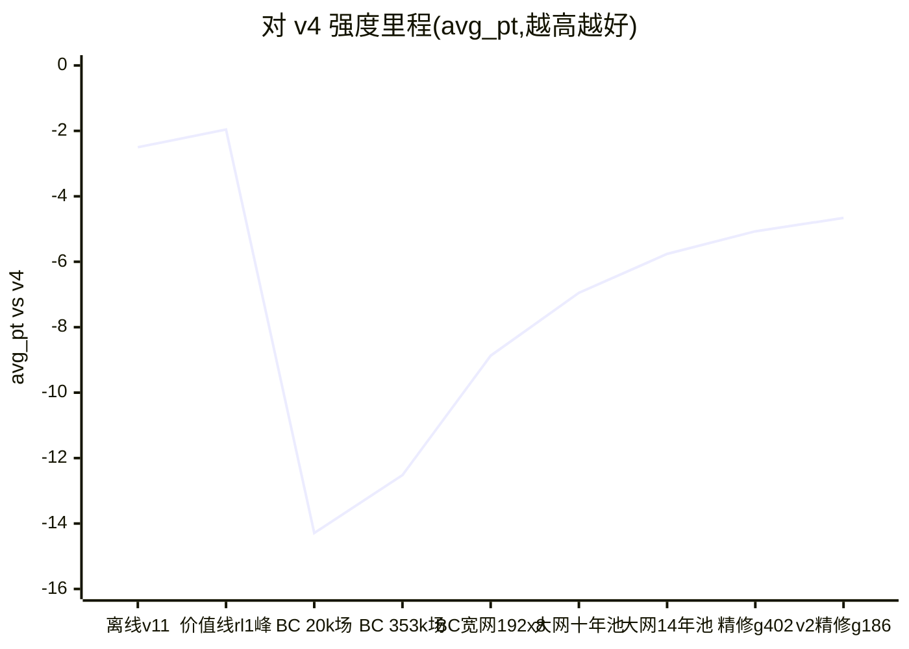
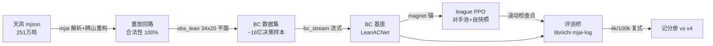

# TanyaoDojo

**JAX 全 GPU 向量化的麻将 AI 训练场**:行为克隆 + 自博弈强化学习全栈,
每一步强度都用**复式 1v3 对抗**量化到小数点后两位。

当前基准对手是开源最强之一的 **Mortal v4**(256ch×54blk,23.8M 参数),目标是稳定超越;
同时孵化川麻纯 RL 线。评测桥依赖上游 [Mortal](https://github.com/Equim-chan/Mortal)
的 libriichi(AGPL-3.0,不随本仓库分发,见 [SETUP.md](SETUP.md))。

> **许可**:根目录 MIT,`jax_rl/mjai_bot/` 为 AGPL-3.0(链接 libriichi)——见 [LICENSING.md](LICENSING.md)。
> **数据**:天凤牌谱及其派生数据集**不分发**,请自备牌谱按 SETUP.md 重建。
> **权重**:四份 checkpoint(含一份 RL 负结果)已发布在 [🤗 Twu31/TanyaoDojo](https://huggingface.co/Twu31/TanyaoDojo)。

- **数据**:天凤凤凰卓 16 年牌谱(251 万局 mjai 格式;受天凤条款约束不入库、不再分发)
- **评测协议(神圣不可变)**:复式 1v3,challenger 轮换 4 座打同一批牌山,
  seed_key=20260711,pt=[90,45,0,-135],champion=mortal_v4。
  分层:400 局=冒烟(±8.5)/ 4k 局=选型(±2.7)/ **100k 局=里程碑(±0.55,CI>0 = 真超 v4)**。

## 现状(2026-08-21)

两代技术栈,一条记分册:

| 线 | 状态 | 最优 | 备注 |
|---|---|---|---|
| **价值线**(Mortal 栈,DQN 式在线值回归) | 已退役 | **-1.96 ± 0.53**(100k) | 首破离线天花板 -2.50;anchor 守稳不涨后关线 |
| **Mahjax 线**(JAX 全 GPU 向量化,当前主线) | 进行中 | **-4.66 ± 0.535**(100k 里程碑) | BC 三杠杆见底(≈ -5);RL 修正后已止跌,GRP 塑形版在跑 |
| 川麻纯 RL | **P1 通过** | — | JAX 环境 vs Python 参考实现**百万局逐决策点零失配**;下一步 P2 接观测/网络/塑形 |

## Mahjax 线架构

- **吞吐**(实测):env 30 万步/秒(Ada);PPO 全训 57.8k 步/秒(窄网 Ada)/ 21k(宽网单 4090)
- **评测桥**:events→obs 无状态重建(差分 100 场逐位全等),64 万决策 fallback=0

## 完整记分册(同一评测协议,可直接互比)

**价值线时代**(100k 局,±0.53):

| 日期 | 模型 | 方案 | avg_pt vs v4 |
|---|---|---|---|
| 2026-07 | v1_best | 离线 SL(192 宽,近 8 年) | -3.99 |
| 2026-07 | **v11** | 离线 SL(+LR 余弦) | **-2.50(离线天花板)** |
| 2026-07 | v5 | 离线 SL(256 宽+防守通道) | -2.67 |
| 2026-07 | v18 | 离线 SL(全 18 年数据) | -3.02 |
| 2026-07 | **rl1_best** | **在线 RL**(值回归+锚) | **-1.96(项目最优)** |

**Mahjax 线**(分辨率随进程升级:4k ±2.7 / 12k ±1.54 / **100k ±0.535**):

| 日期 | 模型 | 方案 | avg_pt vs v4 |
|---|---|---|---|
| 07-29 | BC 353k 场 | BC(窄网 1.75M 参数) | -12.52 |
| 07-29 | league run1 @2.7 亿步 | BC+league RL | -14.81 |
| 08-02 | 宽网欠训 | BC(192×8,1 epoch) | -10.53(欠训假象) |
| 08-02 | **宽网足训** | **BC(192×8,2 epochs)** | **-8.87(本线最优)** |
| 08-03 | 窄网六年池 v3.5 | BC(数据+40%) | -10.46(窄网平台) |
| 08-04 | league m30lr3 @10 亿步 | BC+league RL | -9.70 |
| 08-04 | league m20lr1 @10 亿步 | BC+league RL | -10.41 |
| 08-05 | league 终点 @30 亿步 | BC+league RL(m20lr1/m30lr3) | -9.19 / -9.41(六点横盘,线关闭) |
| 08-04 | 大网 256×10 ep1 | BC(十年池,val 81.2%) | -6.95 |
| 08-04 | 大网 ep2 | BC(过训,val 回落 80.9%) | -9.25(过训回落) |
| 08-06 | 大网 × 14 年池 g1080 | BC(逐档选峰,12k 局定音) | -5.76 ± 1.54 |
| 08-06 | **精修 ft2-g402** | **BC(lr 1e-4 从 g1080 精修,12k 定音)** | **-5.07 ± 1.54(新最优)** |
| 08-08 | 16 年池两轮(+2013-14) | BC(数据+16%,连跑两 epoch) | -5.79 / -5.68(12k,无增量,数据杠杆见底) |
| 08-14 | obs v2 十年池(四档) | BC(观测加富 34×36+32) | -6.18 / -5.90 / -5.64 / -5.52(12k) |
| 08-17 | v2 精修 g186 | BC(obs v2 + lr 1e-4 精修) | -4.86 ± 1.54(12k) |
| 08-21 | **v2 精修 g186** | **同上 · 100k 局里程碑**(1600 万决策 fallback=0) | **-4.66 ± 0.535(本线里程碑)** |

两线注解:价值线的强来自"站在 Mortal 完整基建上微调";本线从零重建全栈,
用缩放律(数据/容量/观测)把差距从 -14.3 压到 **-4.86**。三个 BC 杠杆现已全部见底
(平台 ≈ -5),最后一段交给 RL —— 但 RL 至今四连负,见下表。

## ⚠️ 最大的一次教训:训练目标 ≠ 评测目标(2026-08-23 定位并修正)

四次 RL 全部失败(-19.5 / -14.8 / -9.7 / -8.4,每次都低于各自的 BC 基座)。事后定位到
一个与算法选型无关的共同根因:

| | RL 训练时优化的 | 竞技场评的 |
|---|---|---|
| episode | **一盘**(`round_mode="single"`,一盘结束即终止) | **整个半庄**(8 局) |
| 奖励 | **素点转移**(百点单位) | **顺位点 [90, 45, 0, −135]** |

**实测证据**(直接量,不是读码推断):

- `single` 模式下 600 步 × 256 env 产生 **1541 个 episode** → episode 确实只有一盘;
- 奖励值域 [−120, 130]、样例 `[+30, −10, −10, −10]`、行和 ≈ 0 → 是素点转移;
- mahjax 在终局只把 `order_points` 写进 `state.round_state.score`,**从不写进 `rewards`**
  ——任何 `round_mode` 都一样。

**为什么这一条解释了全部四次失败**:单盘素点最大化器**没有"第四名"这个概念**——跌到第四
不产生额外代价,所以它应当无限激进。而本项目历版记录的失分来源恰恰是四位率偏高。它还预测
"RL 步数越多越差"(实测如此),并解释了 oracle critic 为何比无用更糟:更准的 critic 只是让
策略更快收敛到**错误的**目标——v_loss 下降 100 倍是对错误目标的真实优化进展。

**修正**([`jax_rl/reward_placement.py`](jax_rl/reward_placement.py)):`round_mode="half"`
+ episode 内奖励恒 0 + 终局发竞技场同款顺位点。注意 `auto_reset` 在终局把 state 换成新局、
只保留 `(terminated, truncated, rewards)`,终局分数会丢失,所以顺位必须在重置前算好写进
`rewards`。验证:51 万非终局步奖励恒 0、终局恰为 pt 的置换、行和恒 0、随机策略下均值 0.0000
(顺带复现了 `A(π, π) ≡ 0` 这个代数恒等式——四座同策的复式期望必然为零)。

**修正后的第一个结果(2026-08-23→25,跑满 10 亿步)**:从 -4.66 的冠军基座出发,
沿途 11 次外评(各 1600 局,2.77 亿→9.82 亿步)= **-4.88 ± 0.81**,与基座**统计持平**。

| | 之前四次(错目标) | 修正后 |
|---|---|---|
| 相对各自基座 | **-3.2 ~ -10 pt** | **-0.2 pt(持平)** |
| 训练越久 | 越差 | 不再变差 |

**"越训越差"被止住了,但也还没涨。** 原因在指标里写着:`approx_kl≈4e-5/update`、
跑满 10 亿步后离基座仅 `mag_kl=0.011` —— 紧信任域(ε=0.02)加上每 rollout 只有
**0.75 个半庄终局**,策略几乎没动。所以下一步不是换算法,而是**把信号变密**:
GRP 势函数塑形(`reward_placement.auto_reset_shaped`),用 752 万人类对局样本训一个
"局面 → 终局顺位点期望"的势函数 Φ,奖励改成 `Φ(s') − Φ(s)`,终局补 `pt − Φ(s_T)`。
按势能塑形定理这是**策略不变**的,实测 telescoping 精确成立(奖励和 + Φ(s₀) = pt 的精确置换),
而非零奖励步占比从 0.1% 升到 **1.10%(信号密度 ×11)**。

**给同类项目的提醒**:上游 Mahjax 论文自身的实验用的就是 single-round 模式,其 PPO 超参
被本项目整套移植——**包括那个 `round_mode`**。移植一份配方时,先确认它的 episode 边界与
奖励定义和你的评测目标是同一个函数。

## 关键实验结论(全部 4k 局同协议)

| 实验 | 结果 | 教训 |
|---|---|---|
| BC 数据缩放(窄网) | 20k 场 -14.3 → 353k 场 -12.5,**每翻倍 +2.3pt**;1.05M 场后平台 | 数据杠杆有平台 |
| 容量缩放 | 192×8 足训 **-8.87**(破台);欠训 1 epoch 时假象 -10.5 | **宽网欠训敏感** |
| 纯自博弈 PPO | 50 亿步 -19.5(低于 BC 基座) | 四座同策不迁移(且**目标错配**,见上) |
| 自家族 league(8 臂 ×10 亿步扫描) | 最优 -9.70,均未超基座 | 选优偏差实为 ~0.78pt(只有 2 臂做过外评,非 8);**目标错配** |
| obs 勘误 | env 从不写 discards/meld_tiles(死数组) | 半盲 obs 曾封顶 -10.2 |
| obs v2 加富(时序/手切/立直位/现物) | 峰 **-4.86**(12k),但精修后才显现 | 观测杠杆 ≈ 4 年数据,不与数据叠加 |
| oracle critic(Suphx 式非对称 AC) | 8 亿步 **-8.38**,较基座退 3.2pt | **该结论作废**:跑在错误目标上,非方法本身失败 |
| **100k 里程碑**(v2 精修 g186) | **-4.66 ± 0.535**,CI 全域 < 0 | 距超越 v4 尚差 4.66pt;BC 独走到此为止 |
| **RL 四连负**(自博弈/窄 league/8 臂 league/oracle) | 内部指标漂亮、外部强度掉 | 根因=目标错配;四条线**全部需在修正后重做** |
| **目标修正后重跑**(10 亿步,顺位奖励) | **-4.88 ± 0.81**,与基座持平 | 退化被止住;mag_kl 0.011(当时据此判为"策略几乎没动",**后经行为换算证伪**,见下) |
| GRP 势函数塑形 | 信号密度 0.1%→**1.10%**,telescoping 精确;10.7 亿步 mag_kl **0.022**(旧版同期 0.011) | 策略不变前提下解稀疏,策略位移翻倍 |
| 塑形版外评(第一段 14.8 亿步止) | 两次 12k 定音 **-3.79** / **-4.04**;全线合并 **-3.78 ± 0.85** | 相对基座 **+0.88 ± 1.00**,z=1.73;**两次定音各自都不显著**(0.87/1.05σ、0.62/0.74σ) |
| 锚是否约束住"被打分的分布" | KL_human/KL_self = **0.89**(非 ≫1);人类 top-1 仅掉 0.26pp | 锚有效,该担忧在当前漂移量级下**不成立** |
| 单局尺度 ρ(报告主张 <0.15) | 实测 **0.235**(70.8 万半庄 / 2724 万「局×家」样本),R²=0.055 | 报告的**数值不成立**(高估约 57%);但单局仅解释 5.5% 顺位方差,组相对路线仍低效 |
| 熵系数方向(报告自陈可能反了) | 评测本就走 argmax;策略自身 Q 下 τ∈[0.01,2] 每决策价值变化 |Δ|≤0.0004pt(CI 全含 0),熵 13 亿步稳在 0.50±0.01 | **两个方向都无价值可回收**,ent_coef 不是当前杠杆 |
| sp 求解器特征 +1.0~1.5pt(报告主张) | 弃张效率实测:RL 13.4 亿步与 BC 基座**几乎全等**(向听最优 96.42% vs 96.36%,受入亏欠 3.85% vs 3.72%) | 偏离是**取舍不是错误**(模仿人类的基座偏离得一样多);该增益最廉价的来源被排除,主张存疑 |
| 8 臂选优偏差 ~1.9pt(报告主张) | 算术对(E[max₈]=1.4236σ,4k 的 σ=1.38pt → 1.96pt);但当年**只有 2 臂做过外评**,其余 6 臂被内部指标 lr_r 先筛掉 → 适用值 E[max₂]=**0.78pt** | 公式成立、**套在本次扫描上不成立**;-9.70 去偏到 ≈-10.5(上界 -11.7),结论不变 |
| 4k 亮点必回拉(本项目铁律) | 第 5 次坐实:b1408 的 4k -3.57 → 12k **-4.04**;b512 的 4k -1.29/-3.50 → 12k -3.79 | 单段 4k 只配做筛选,**任何纪录/结论一律以 12k 双段为准** |
| 我们自己的 CI 口径(复核) | `run_eval` 按**局**算 CI,但複式同一副牌四个旋转不独立;实测 ICC = **−0.079**,按**牌局组**算的 CI 只有按局的 **0.873 倍** | 现行 CI **偏保守 13%**,真实分辨率 4k ±2.36 / 12k ±1.34 / 100k ±0.467;过去所有判读都是低估显著性,结论方向不变 |
| **配对头对头**(b1408 vs 基座 g186,**同 2000 副牌**) | **+0.636 ± 1.90**,z=0.66;同牌相关 r=+0.307,配对削减方差 **30.7%** | 迄今最干净的一次比较:效应真在正侧但**8000 局分辨不出来**;ICC 在两个模型上复现(−0.079 / −0.093) |
| 测量预算(由上式反推) | 把 +0.64pt 打到 2σ 需 **7.15 万局×2 ≈ 86 小时 CPU**;+2pt 只需 7 千局×2 ≈ 9 小时 | **做大效应比测细效应便宜一个量级** —— 下一步应放开信任域而不是加评测局数 |
| **KL→行为换算**(自我订正) | b1408 与基座 top-1 **不一致 3.10%**(≈30 决策/半庄),非"几乎没动";对照:错目标的 oracle 臂不一致 **5.30%** 却退 3.3pt | **"锚过紧"这个前提站不住**;距离本身不决定强弱,方向才决定。`policy_shift.py` 从此作为免费**先行指标**(几分钟出,替代 9 小时外评) |

## 川麻线(血战到底)进展

从零 RL 的第二条线,与立直线共用 JAX 栈与评测方法论,但**结构性免疫目标错配**
——川麻现实中逐盘结钱,训练目标 = 评测目标 = 钱,不存在"半庄顺位"这层转换。

| 阶段 | 内容 | 判据 | 状态 |
|---|---|---|---|
| P0 | 规则冻结 + Python 参考实现 + 查表核心 + L0-L3 规则梯子 + 复式竞技场 | 862 单测全绿;查表 3 万例零不符;A(π,π)≡0 | ✅ |
| **P1** | **`sichuan/env_jax.py`(551 行,定长数组 / jit-vmap 友好)** | **百万局逐决策点差分零失配** | ✅ |
| **P2** | **观测 + 网络(1.52M) + 手工向听塑形 + 三条免费仪表 + 评测桥** | **1.05 亿步即达标(预算的 35%)** | ✅ |
| P3 | 100 亿步 + league(池含 L0/L1/L3 谱系外对手) | 对 L5 组级 bootstrap CI 全域 > 0 | **改序**:先解熵塌缩再上 league |

**P2 结果(2026-09-06,1.05 亿步 / 3 亿步预算)**:复式 1v3,挑战者轮坐四座打同一副牌山。

| 挑战者 | vs 3×L0(300 副牌) | 配对差 vs L1 |
|---|---|---|
| 手写规则 L1(贪心向听) | +3.949 ± 0.355 | — |
| **从零 RL b800(1.05 亿步)** | **+6.872 ± 0.500** | **+2.922 ± 0.565,z=10.1** |
| 从零 RL b2272(2.98 亿步,跑满预算) | +6.343 ± 0.486 | +2.394 ± 0.548,z=8.6 |

判据是"3 亿步内显著超过 L1",实际在 **35% 的预算内**通过。效应大(+2.9pt)所以
300 副牌就够——这正是 [测量预算](#) 那条教训的反面用例:大效应便宜,小效应测不起。

### ⚠️ 订正(2026-09-07):上表的"vs 3×L0"是一把**饱和**的尺子

本节最初写着"b2272 − b800 = −0.528(z=−2.13),多跑 1.9 亿步不但没买到东西、名义上
还退了",并据此说"学习在 1 亿步前就停了"。**两句都不准确,原因是测量工具本身。**

L0 是均匀随机策略,对随机对手能榨出的分数有硬上限。实测该尺度在 **+6 附近饱和,
而且在饱和区内会给出反向排序**:

| | vs 3×L0 | 直接对打(不饱和) |
|---|---|---|
| b192(2517 万步) | **+6.775** | −1.422 ± 0.411 |
| b2272(2.98 亿步) | +6.343 | **0**(锚点) |

即 L0 尺度判 b192 强于 b2272,而两者**直接对打** b2272 赢 **+1.59**(双向一致,
z=+7.9 / −6.8)。阳性对照 `b800 vs 3×b32 = +5.614 ± 0.465` 证明该仪表分辨力充足。

**改用"对当前最强快照直接对打"重建曲线后**(全部同一批 300 副牌山,
锚点自身按 `A(π,π)≡0` 恒为 0):

| 档 | 步数 | vs 3×b2272 | 相邻档配对差 |
|---|---|---|---|
| b32 | 419 万 | −5.216 ± 0.344 | — |
| b96 | 1259 万 | −5.124 ± 0.365 | +0.092,z=0.45 |
| b192 | 2517 万 | −1.422 ± 0.411 | **+3.703,z=15.5** |
| **b384** | **5033 万** | **−0.245 ± 0.369** | **+1.177,z=4.51** |
| b800 | 1.05 亿 | −0.058 ± 0.323 | +0.187,z=0.91 |
| b1408 | 1.85 亿 | −0.085 ± 0.333 | −0.027,z=−0.13 |
| b2272 | 2.98 亿 | 0(恒等) | +0.085,z=0.50 |
| L1 | — | −2.062 ± 0.336 | — |

**结论订正**:

- **学习在 b384 = 5033 万步(预算的 17%)完成**,之后 83% 的预算买到
  +0.245 ± 0.369(z=1.30,不显著)。
- **`b2272 − b800` 的正确读数是直接对打的 +0.035 ± 0.270(z=0.26)**,不是 −0.528。
  "多跑 1.9 亿步没变强"成立;"名义上还退了"**撤回**。
- L0 尺度**整段漏掉了 b192→b384 那次真实的 +1.18** 增长。
- **P2 判据的结论不变**:b2272 相对 L1 在不饱和尺度上是 +2.06,与 L0 尺度上的
  +2.4~+2.9 同量级。但**上表所有 vs 3×L0 的 margin 不应再当作进展刻度。**

**教训**:这与本项目最大的那次教训(训练目标 ≠ 评测目标)是同一个形状 ——
**测量工具比被测对象先到极限,而它不会报错,只会给出一条平坦甚至反向的曲线。**
判"没有进步"之前,必须先证明尺子还能分辨(阳性对照),以及尺子没有饱和(换锚重测)。
仪表见 [`sichuan/eval_h2h.py`](sichuan/eval_h2h.py)。

### 同一族的第二个坑:自谱系对决把外部进步放大 2.3 倍(2026-09-08)

换成"对当前最强快照直接对打"之后,又撞上它的对偶问题:**那个锚也在自己的谱系里。**

在这套不饱和的自谱系尺度上,一条加了 dual-clip 的臂"打赢自己的过去"跑出两段
**各 z≈3**(5033 万→1.51 亿 +0.491,1.51 亿→3.02 亿 +0.512,合计 +1.003)。
换到**谱系外**对手(手写规则 L1,不在任何 RL 谱系里)重测:

| | 步数 | vs 3×L1 |
|---|---|---|
| 老线 b384 | 5033 万 | +1.903 ± 0.367 |
| 老线 b2272 | 2.98 亿 | +2.078 ± 0.354 |
| dual-clip | 5033 万 | +1.720 ± 0.372 |
| dual-clip | 3.02 亿 | +2.157 ± 0.380 |

外部实测只有 **+0.437 ± 0.438(z=1.96)**,而且**终点与老线持平**(+0.079,z=0.38):
它起点低 0.182,涨得多一点,回到同一个地方。**放大倍数 1.003 / 0.437 = 2.3。**

**但自谱系曲线并非不可用** —— 用于看**同一条线内部的形状**时它是可信的:
老线的锚定读数 +1.177 / +0.245 被 L1 的 +0.807 / +0.175 独立确认,
"学习在 5033 万步完成"因此站得住。

> **规矩**:判"某配方更强"必须有**谱系外**对手的读数;
> 自谱系曲线只能用来看同一条线内部的形状。

**本轮四个干预在谱系外尺度上全部为零**:加步数 ×6(+0.175,z=0.82)、
容量 ×3.8(+0.065,z=0.44)、GAE 差一位修正(+0.022,z=0.10)、
dual-clip(终点 +0.079,z=0.38)。dual-clip 确凿做到的只有机制层面的两件事:
自由决策点熵 +58%,以及把"平台"换成一条仍在缓慢上升的曲线 —— 但 6 倍预算下净收益为零。

**这个读数为什么可信**:评测桥用"参考实现跑对局 + JAX 影子状态同步"的方式接网络
(规则机器人都是写给参考实现的),影子一旦失步,网络就是在看错的局面下棋,而分数
照样算得出来——这种 bug 不崩,只会把评测安静地变成噪声。所以每个网络决策点都对一次
合法集并统计动作回退:**58,132 次决策,合法集不符 0,回退 0**。基准侧让 L1 走完全
同一套评测代码、同一批牌山,得 +3.949,与方案记录的 +3.867 吻合。

**P3 因此改序,预算也要重估**:原计划直接上 100 亿步 + league,但证据说这个配方在
**5033 万步**就停止学习,堆 200 倍算力只会把同一个塌缩策略跑得更久。三件事按序做:

1. **换刻度**:今后学习曲线一律用"对当前最强快照的直接对打"来量,并常设阳性对照;
   规则梯子只在 +6 以下有分辨力。P3 的 100 亿步是按饱和刻度定的,须重估。
2. **先证明策略能重新移动**再谈对手池:提熵之后用 `policy_shift.py` 那套先行指标看。
   注意**熵仪表本身要改**:实测 **72.9% 的决策点只有 1 个合法动作**,均值熵有 73%
   结构性恒为 0,`|legal|≥5` 桶从 b32 的 0.495 掉到 b2272 的 0.173(−65%),
   而均值只掉 14%。拿均值当被控量等于调一个动不了的数。
3. 对手池按外部证据取"课程 + 快照池 + 保留最好的 checkpoint",
   **不做 exploiter、不做 PFSP 加权**。

**同时必须记下的隐患**:该策略的熵已塌到 **0.048 nats**,
逐状态 max_ratio 冲到 3-6、max_kl 到 1.5-4;均值型指标(clip_frac 0.006、
adv_osc 0.02、vloss 在降)全都好看,**只有尾部仪表报警**——这就是把它们做成
免费常驻指标的理由。

**但这个 0.048 本身也是一把钝尺(2026-09-07 补测)**:它是对**所有**决策点求的平均,
而实测 **72.9% 的决策点只有 1 个合法动作**(摸切/被迫应答),熵结构性恒为 0。
按 `|legal|` 分桶后:

| 档 | 全部决策点均值熵 | `|legal|≥5` 桶 | 有效动作 |
|---|---|---|---|
| b32(419 万步) | 0.0808 | **0.4947** | 1.64 |
| b800(1.05 亿步) | 0.0609 | 0.1973 | 1.22 |
| b2272(2.98 亿步) | 0.0702 | **0.1729** | 1.19 |

**真正有得选的决策点熵掉了 65%,而均值只掉 14%** —— 塌缩是真的(判据线是
"`|legal|≥5` 仍有 0.5+ nats 则为假象",实测 0.17,不成立),但**我们一直看的那个数
低报了它**。推论:任何以均值熵为被控量的闭环控制器,调的是一个 73% 动不了的数;
目标带必须按 `|legal|≥2` 或 `≥5` 标定。

**P1 的价值在于它抓到了什么**:百万局差分在 40 万-42.5 万 seed 段报出 2 例失配
(发生率 2.7e-4)。实例 seed=402578:玩家 2 打出一张牌,响应队列 `[3,0,1]`,玩家 3
与 0 **同时荣和**;参考实现把牌判给队列首位的玩家 3,而 JAX 版用 `argmax(ron_flag)`
取到了编号最小的玩家 0——响应队列自打牌者下家起算,与编号顺序不一致,**只有一炮多响
时才暴露**。而牌数守恒、零和这些不变量在该 bug 下**全部照常通过**。

另一个同类陷阱:**JAX 对越界索引静默截断到末元素而不报错**,曾让发牌循环给每家发了
13 张同一张牌,同样骗过全部不变量。两者都印证同一条:环境 bug 会无声毒化 RL,
**差分测试通过前不开训练**。

## 基础设施

| 机器 | 硬件 | 角色 | 状态 |
|---|---|---|---|
| 本机(Win11+WSL2) | RTX 5060 Ti 8GB / 20T | 训练·评测·开发(当前唯一在岗) | 长期在跑 |
| 训练服务器 | RTX 6000 Ada 49GB / 48C | BC 大训练(共享,让位优先) | 长期不可用 |
| 云 8×4090(compshare) | 8×RTX 4090 / 112C | league 扫描·数据构建 | 已释放 |

单机长跑的取舍:8GB 显存下 league PPO(learner + 3 对手前向)约 3.9k 步/秒,
1 亿步 ≈ 7 小时;评测把冠军放 CPU、训练独占 GPU,两边同时满载。

## 布局速览

- `jax_rl/` **当前主线**:ppo_fast / ppo_league / bc_stream / obs_lean / net_lean、
  `data_bridge/`(mjai 解析+重放)、`mjai_bot/`(评测桥)、cloud_setup.sh
- `sichuan/` `common/` **川麻线**:规则参考实现(862 测试)、L0-L3 规则梯子、复式竞技场、
  5 进制查表核心(胡牌/向听 O(1),3 万例零不符)、势能塑形(telescoping 已验证)
- `Mortal/`(**不入库**)上游 clone,评测桥的 libriichi 由此构建 —— 见 SETUP.md
- `configs/` `scripts/` 价值线时代的训练/评测/自对弈(历史)
- `data/` `runs/` `weights_backup/` gitignore(数据不可分发;权重超 GitHub 单文件限)

## 文档地图

| 文档 | 内容 |
|---|---|
| [SETUP.md](SETUP.md) | 环境搭建:依赖版本、Mahjax/libriichi 克隆、数据自建、冒烟自检 |
| [RESULTS.md](RESULTS.md) | 价值线时代记分册(历史) |
| [sichuan/RULES.md](sichuan/RULES.md) | 川麻规则冻结 v0 |
| [LICENSING.md](LICENSING.md) | 分目录双许可说明(MIT / AGPL-3.0) |
