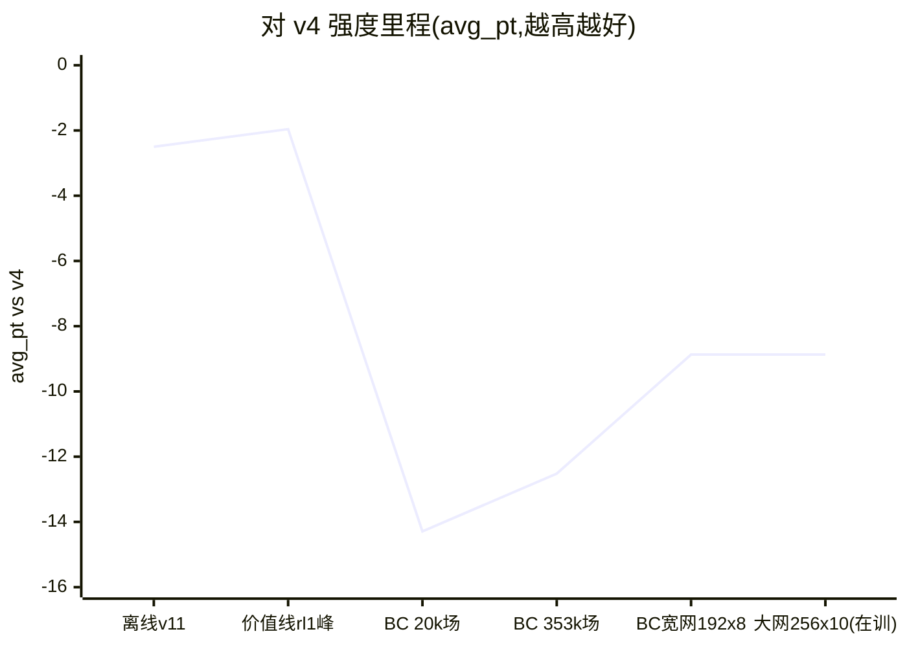
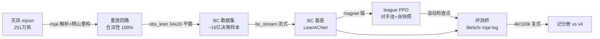

# Better_mortal

训一个**稳定强于 Mortal v4**(256ch×54blk,23.8M 参数)的立直麻将 AI,并孵化川麻纯 RL 线。

- **数据**:天凤凤凰卓 16 年牌谱(251 万局 mjai 格式;受天凤条款约束不入库、不再分发)
- **评测协议(神圣不可变)**:复式 1v3,challenger 轮换 4 座打同一批牌山,
  seed_key=20260711,pt=[90,45,0,-135],champion=mortal_v4。
  分层:400 局=冒烟(±8.5)/ 4k 局=选型(±2.7)/ **100k 局=里程碑(±0.55,CI>0 = 真超 v4)**。

## 现状(2026-08-04)

两代技术栈,一条记分册:

| 线 | 状态 | 最优 | 备注 |
|---|---|---|---|
| **价值线**(Mortal 栈,DQN 式在线值回归) | 已退役 | **-1.96 ± 0.53**(100k) | 首破离线天花板 -2.50;anchor 守稳不涨后关线 |
| **Mahjax 线**(JAX 全 GPU 向量化,当前主线) | 进行中 | **-8.87 ± 2.70**(4k) | 6 天从零重建全栈;BC 三级火箭(容量/数据/obs)在燃 |
| 川麻纯 RL | P0 完成 | — | 规则冻结 + 纯 Python oracle + 862 测试全绿,待 P1 |

## Mahjax 线架构

- **吞吐**(实测):env 30 万步/秒(Ada);PPO 全训 57.8k 步/秒(窄网 Ada)/ 21k(宽网单 4090)
- **评测桥**:events→obs 无状态重建(差分 100 场逐位全等),64 万决策 fallback=0

## 关键实验结论(全部 4k 局同协议)

| 实验 | 结果 | 教训 |
|---|---|---|
| BC 数据缩放(窄网) | 20k 场 -14.3 → 353k 场 -12.5,**每翻倍 +2.3pt**;1.05M 场后平台 | 数据杠杆有平台 |
| 容量缩放 | 192×8 足训 **-8.87**(破台);欠训 1 epoch 时假象 -10.5 | **宽网欠训敏感** |
| 纯自博弈 PPO | 50 亿步 -19.5(低于 BC 基座) | 四座同策不迁移 |
| 自家族 league(8 臂 ×10 亿步扫描) | 最优 -9.70,均未超基座 | 剥削自家 ≠ 逼近 v4;**RL 转向 oracle critic** |
| obs 勘误 | env 从不写 discards/meld_tiles(死数组) | 半盲 obs 曾封顶 -10.2 |

## 基础设施

| 机器 | 硬件 | 角色 |
|---|---|---|
| 本机(Win11+WSL2) | RTX 5060 Ti 8GB / 14C | 开发·评测·对照训练 |
| 训练服务器 | RTX 6000 Ada 49GB / 48C | BC 大训练(让位优先) |
| 云 8×4090(compshare) | 8×RTX 4090 / 112C / 940GB | league 扫描·全量数据构建 |

## 布局速览

- `jax_rl/` **当前主线**:ppo_fast / ppo_league / bc_stream / obs_lean / net_lean、
  `data_bridge/`(mjai 解析+重放)、`mjai_bot/`(评测桥)、`sichuan/`(川麻 P0)、cloud_setup.sh
- `Mortal/` 上游 clone + 价值线补丁(评测桥的 libriichi 仍在用)
- `configs/` `scripts/` 价值线时代的训练/评测/自对弈(历史)
- `data/` `runs/` `weights_backup/` gitignore(数据不可分发;权重超 GitHub 单文件限)

## 文档地图

| 文档 | 内容 |
|---|---|
| [MAHJAX_MIGRATION.md](MAHJAX_MIGRATION.md) | **从这里开始**:R0-R4 全记录、实验定量、坑志 |
| [SICHUAN_RL_PLAN.md](SICHUAN_RL_PLAN.md) | 川麻纯 RL 立项与 Mahjax 基准 |
| [jax_rl/sichuan/RULES.md](jax_rl/sichuan/RULES.md) | 川麻规则冻结 v0 |
| [HANDOFF.md](HANDOFF.md) / [RESULTS.md](RESULTS.md) / [TRACK_C_SELFPLAY.md](TRACK_C_SELFPLAY.md) | 价值线时代(历史) |
| [RL_SIM_PLAN.md](RL_SIM_PLAN.md) / [SETUP_NOTES.md](SETUP_NOTES.md) | 算力账·环境坑(部分历史) |
