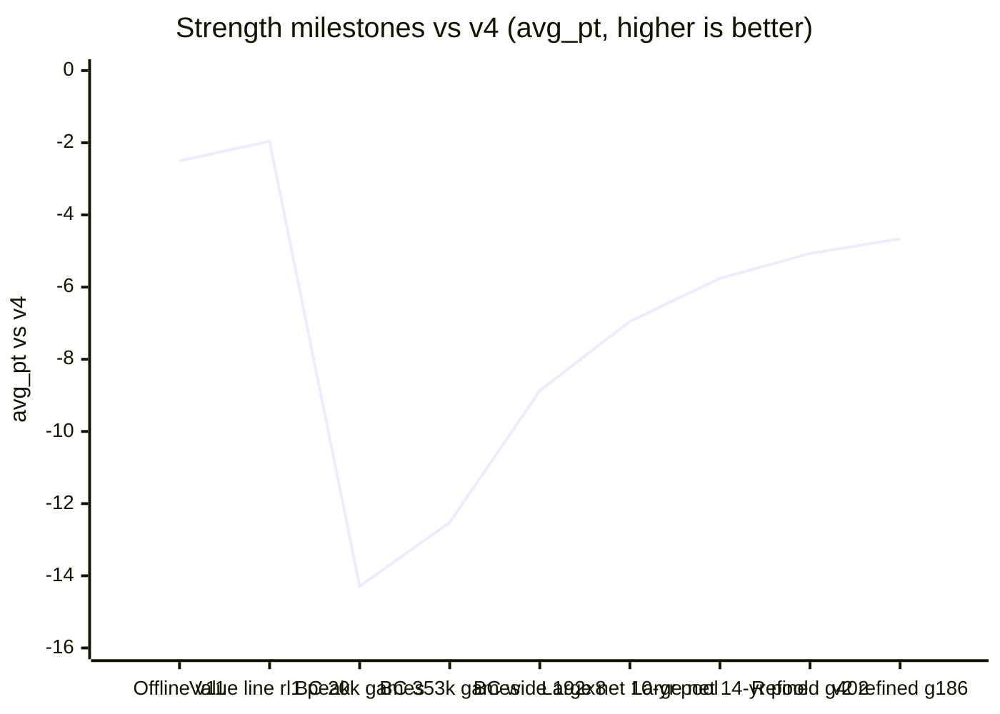
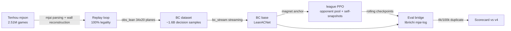

# TanyaoDojo

**A mahjong AI training ground, fully GPU-vectorized in JAX**: a complete behavior-cloning + self-play
reinforcement-learning stack, with every step in strength quantified to two decimal places by **duplicate 1v3 matches**.

The current benchmark opponent is **Mortal v4** (256ch×54blk, 23.8M parameters), one of the strongest open-source
mahjong AIs; the goal is to beat it consistently. A pure-RL line for Sichuan mahjong is being incubated alongside.
The evaluation bridge depends on libriichi from upstream [Mortal](https://github.com/Equim-chan/Mortal)
(AGPL-3.0, not distributed with this repository; see [SETUP.md](SETUP.md)).

> **License**: MIT at the root; `jax_rl/mjai_bot/` is AGPL-3.0 (it links libriichi) — see [LICENSING.md](LICENSING.md).
> **Data**: Tenhou game logs and any datasets derived from them are **not distributed**; bring your own logs and rebuild them following SETUP.md.
> **Weights**: four checkpoints (including one negative RL result) are published at [🤗 Twu31/TanyaoDojo](https://huggingface.co/Twu31/TanyaoDojo).

- **Data**: 16 years of Tenhou Phoenix-room game logs (2.51M games in mjai format; bound by Tenhou's terms, so neither checked in nor redistributed)
- **Evaluation protocol (sacred, never changed)**: duplicate 1v3 — the challenger rotates through all 4 seats over the same set of walls;
  seed_key=20260711, pt=[90,45,0,-135], champion=mortal_v4.
  Tiers: 400 games = smoke test (±8.5) / 4k games = candidate selection (±2.7) / **100k games = milestone (±0.55; CI > 0 = genuinely beats v4)**.

## Status (2026-09-30)

Two generations of tech stack, one scorecard:

```mermaid
xychart-beta
    title "Strength milestones vs v4 (avg_pt, higher is better)"
    x-axis ["Offline v11", "Value line rl1 peak", "BC 20k games", "BC 353k games", "BC wide 192x8", "Large net 10-yr pool", "Large net 14-yr pool", "Refined g402", "v2 refined g186"]
    y-axis "avg_pt vs v4" -16 --> 0
    line [-2.50, -1.96, -14.29, -12.52, -8.87, -6.95, -5.76, -5.07, -4.66]
```

| Line | Status | Best | Notes |
|---|---|---|---|
| **Value line** (Mortal stack, online value regression + anchoring) | Own pipeline 100k **-0.64**; offline base scaled up to v4's size (256×54): 100k -2.68, paired vs v11 -0.18 ± 0.62 → capacity ruled out | Fine-tuned from v4 for 40k steps: **+0.123 ± 0.101 over 1.1M games (significant)** — but that is "v4 + our RL" and does not count toward the own-pipeline goal | The gap has been priced down to individual decisions (counterfactual rollouts on the true walls): push/fold -0.15, riichi judgment about -0.18, ordinary tile choice zero; the excess pushing is caused by online RL. GRP truncation shows no visible bias at the decision level. See the A², Step 0, B1 and GRP sections of [RESULTS.md](RESULTS.md) |
| **Mahjax line** (fully GPU-vectorized JAX) | Stopped (2026-09-11) | **-4.66 ± 0.535** (BC base, 100k); best RL 12k -3.38 (z=1.77, not significant) | A clean rerun after fixing the objective mismatch, the wall RNG and the GAE reset was still flat (vs the contaminated line at equal compute: +0.09 ± 1.91); **gap located: offense -95 / defense -13 points per hand, riichi rate 2.41pp below v4 — too passive** |
| Sichuan pure RL | **P2 passed**, P3 paused | Beats L1 by **+2.92 (z=10.1)** at 105M steps | All four P3 interventions (steps ×6, capacity ×3.8, GAE fix, dual-clip) are zero on the out-of-lineage scale; plateau vs 3×L1 ≈ +2.2 |

> **Correction, 2026-09-12: the value line had not "held steady without improving".** When the line was shut down, only
> test_play had been looked at. Re-evaluated under the sacred protocol, the anchored line C' reached **-0.75 ± 1.31** at 12k
> only 9 hours after the anchor weight was relaxed from 0.5 to 0.2 — paired, stronger than rl1_best by **+1.75 (z=2.58)** and
> than the λ=0.5-phase snapshot by +1.56 (z=2.37), whereas the roughly 36 hours at λ=0.5 changed nothing (+0.19, z=0.33).
> Training has been resumed from that snapshot, aiming to match v4. Details in the last section of [RESULTS.md](RESULTS.md).

## Mahjax line architecture

```mermaid
graph LR
    A[Tenhou mjson<br/>2.51M games] -->|mjai parsing + wall reconstruction| B[Replay loop<br/>100% legality]
    B -->|obs_lean 34x20 planes| C[BC dataset<br/>~1.6B decision samples]
    C -->|bc_stream streaming| D[BC base<br/>LeanACNet]
    D -->|magnet anchor| E[league PPO<br/>opponent pool + self-snapshots]
    E -->|rolling checkpoints| F[Eval bridge<br/>libriichi mjai-log]
    D --> F
    F -->|4k/100k duplicate| G[Scorecard vs v4]
```

- **Throughput** (measured): env 300k steps/s (Ada); full PPO training 57.8k steps/s (narrow net, Ada) / 21k (wide net, single 4090)
- **Eval bridge**: stateless events→obs reconstruction (bit-identical over 100 games in a differential test), fallback=0 across 640k decisions

## Full scorecard (same evaluation protocol, directly comparable)

**Value line era** (100k games, ±0.53):

| Date | Model | Method | avg_pt vs v4 |
|---|---|---|---|
| 2026-07 | v1_best | Offline SL (192 wide, most recent 8 years) | -3.99 |
| 2026-07 | **v11** | Offline SL (+ cosine LR) | **-2.50 (offline ceiling)** |
| 2026-07 | v5 | Offline SL (256 wide + defense channels) | -2.67 |
| 2026-07 | v18 | Offline SL (all 18 years of data) | -3.02 |
| 2026-07 | rl1_best | Online RL (value regression + anchor) | -1.96 (100k) |
| 2026-07-24 (re-evaluated 09-12) | **C' final** | **Online value regression + Q anchoring (λ 0.5→0.2)** | **-0.75 ± 1.31 (12k, project best)** |

**Mahjax line** (resolution upgraded as the line progressed: 4k ±2.7 / 12k ±1.54 / **100k ±0.535**):

| Date | Model | Method | avg_pt vs v4 |
|---|---|---|---|
| 07-29 | BC 353k games | BC (narrow net, 1.75M parameters) | -12.52 |
| 07-29 | league run1 @ 270M steps | BC + league RL | -14.81 |
| 08-02 | Wide net, undertrained | BC (192×8, 1 epoch) | -10.53 (undertraining artifact) |
| 08-02 | **Wide net, fully trained** | **BC (192×8, 2 epochs)** | **-8.87 (line best at the time)** |
| 08-03 | Narrow net, 6-year pool v3.5 | BC (+40% data) | -10.46 (narrow-net plateau) |
| 08-04 | league m30lr3 @ 1B steps | BC + league RL | -9.70 |
| 08-04 | league m20lr1 @ 1B steps | BC + league RL | -10.41 |
| 08-05 | league endpoint @ 3B steps | BC + league RL (m20lr1/m30lr3) | -9.19 / -9.41 (flat across six checkpoints; line closed) |
| 08-04 | Large net 256×10 ep1 | BC (10-year pool, val 81.2%) | -6.95 |
| 08-04 | Large net ep2 | BC (overtrained, val falls back to 80.9%) | -9.25 (overtraining regression) |
| 08-06 | Large net × 14-year pool g1080 | BC (peak picked checkpoint by checkpoint, settled at 12k games) | -5.76 ± 1.54 |
| 08-06 | **Refined ft2-g402** | **BC (refined from g1080 at lr 1e-4, settled at 12k)** | **-5.07 ± 1.54 (new best)** |
| 08-08 | 16-year pool, two passes (+2013-14) | BC (+16% data, two epochs back to back) | -5.79 / -5.68 (12k; no gain, data lever exhausted) |
| 08-14 | obs v2, 10-year pool (four checkpoints) | BC (richer observation 34×36+32) | -6.18 / -5.90 / -5.64 / -5.52 (12k) |
| 08-17 | v2 refined g186 | BC (obs v2 + lr 1e-4 refinement) | -4.86 ± 1.54 (12k) |
| 08-21 | **v2 refined g186** | **Same as above · 100k-game milestone** (16M decisions, fallback=0) | **-4.66 ± 0.535 (this line's milestone)** |

A note on the two lines: the value line's strength comes from "fine-tuning on top of Mortal's complete infrastructure";
this line rebuilt the whole stack from scratch and used scaling laws (data / capacity / observation) to squeeze the gap
from -14.3 down to **-4.86**. All three BC levers have now bottomed out (plateau ≈ -5), and the last stretch is handed
to RL — but RL has so far failed four times in a row; see the table below.

## ⚠️ The biggest lesson: training objective ≠ evaluation objective (located and fixed 2026-08-23)

All four RL runs failed (-19.5 / -14.8 / -9.7 / -8.4, each below its own BC base). In hindsight they were traced to
a common root cause that has nothing to do with the choice of algorithm:

| | What RL optimized during training | What the arena scores |
|---|---|---|
| Episode | **One hand** (`round_mode="single"`; the episode terminates as soon as the hand ends) | **The entire hanchan** (8 hands) |
| Reward | **Raw point transfer** (in units of 100 points) | **Placement points [90, 45, 0, −135]** |

**Measured evidence** (measured directly, not inferred from reading the code):

- In `single` mode, 600 steps × 256 envs produce **1541 episodes** → an episode really is a single hand;
- Rewards range over [−120, 130], with samples like `[+30, −10, −10, −10]` and rows summing to ≈ 0 → raw point transfers;
- At game end mahjax writes `order_points` only into `state.round_state.score`, **never into `rewards`**
  — under every `round_mode`.

**Why this one item explains all four failures**: a single-hand raw-point maximizer **has no concept of "fourth place"** —
dropping to fourth costs it nothing extra, so it should be maximally aggressive. And the source of lost points recorded
in every past version of this project is precisely an elevated fourth-place rate. The mismatch also predicts that "more
RL steps make things worse" (which is what we measured), and it explains why the oracle critic was worse than useless:
a more accurate critic only makes the policy converge faster onto the **wrong** objective — the 100× drop in v_loss was
genuine optimization progress on the wrong objective.

**The fix** ([`jax_rl/reward_placement.py`](jax_rl/reward_placement.py)): `round_mode="half"`
+ reward fixed at 0 inside the episode + the arena's own placement points paid at game end. Note that at game end
`auto_reset` swaps the state for a new game and keeps only `(terminated, truncated, rewards)`, so the final scores are
lost — the placements must be computed before the reset and written into `rewards`. Verification: reward is 0 on all
510k non-terminal steps, terminal rewards are exactly a permutation of pt, rows always sum to 0, and the mean under a
random policy is 0.0000 (which incidentally reproduces the algebraic identity `A(π, π) ≡ 0` — with the same policy in
all four seats, the duplicate expectation must be zero).

**First result after the fix (2026-08-23→25, full 1B steps)**: starting from the -4.66 champion base,
11 external evaluations along the way (1600 games each, 277M→982M steps) = **-4.88 ± 0.81**, **statistically level**
with the base.

| | The four earlier runs (wrong objective) | After the fix |
|---|---|---|
| Relative to each run's base | **-3.2 to -10 pt** | **-0.2 pt (level)** |
| The longer it trains | The worse it gets | No longer gets worse |

**"The longer it trains, the worse it gets" has been stopped — but it has not started improving either.** The metrics say
why: `approx_kl≈4e-5/update`, and after a full 1B steps the policy is only `mag_kl=0.011` away from the base — a tight
trust region (ε=0.02) plus only **0.75 hanchan terminals** per rollout left the policy almost unmoved. So the next step
is not a different algorithm but **denser signal**:
GRP potential shaping (`reward_placement.auto_reset_shaped`) trains a potential Φ, "position → expected final placement
points", on 7.52M samples from human games; the reward becomes `Φ(s') − Φ(s)`, with `pt − Φ(s_T)` added at game end.
By the potential-based shaping theorem this is **policy-invariant**; the telescoping holds exactly in measurement (the
reward sum + Φ(s₀) is exactly a permutation of pt), and the share of steps with non-zero reward rises from 0.1% to
**1.10% (signal density ×11)**.

**A warning for similar projects**: the upstream Mahjax paper's own experiments use single-round mode, and this project
ported its PPO hyperparameters wholesale — **including that `round_mode`**. When you port a recipe, first confirm that
its episode boundary and reward definition are the same function as your evaluation objective.

## Key experimental findings (all 4k games, same protocol)

| Experiment | Result | Lesson |
|---|---|---|
| BC data scaling (narrow net) | 20k games -14.3 → 353k games -12.5, **+2.3pt per doubling**; plateaus after 1.05M games | The data lever has a plateau |
| Capacity scaling | 192×8 fully trained **-8.87** (breaks through the plateau); undertrained at 1 epoch it shows a misleading -10.5 | **Wide nets are sensitive to undertraining** |
| Pure self-play PPO | 5B steps -19.5 (below the BC base) | Four seats playing one policy does not transfer (and the **objective was mismatched**; see above) |
| Self-family league (8 arms × 1B-step sweep) | Best -9.70; none beat the base | The selection bias is really ~0.78pt (only 2 arms were evaluated externally, not 8); **objective mismatch** |
| obs erratum | The env never writes discards/meld_tiles (dead arrays) | The half-blind obs once capped strength at -10.2 |
| obs v2 enrichment (temporal order / hand-discard flags / riichi tile position / genbutsu) | Peak **-4.86** (12k), but it only showed after refinement | The observation lever ≈ 4 years of data, and it does not stack with data |
| Oracle critic (Suphx-style asymmetric AC) | 800M steps **-8.38**, 3.2pt below the base | **This conclusion is void**: it ran on the wrong objective; it is not a failure of the method itself |
| **100k milestone** (v2 refined g186) | **-4.66 ± 0.535**, the whole CI < 0 | Still 4.66pt short of beating v4; this is as far as BC alone goes |
| **Four RL failures in a row** (self-play / narrow league / 8-arm league / oracle) | Internal metrics look great, external strength drops | Root cause = objective mismatch; all four lines **must be redone after the fix** |
| **Rerun after the objective fix** (1B steps, placement reward) | **-4.88 ± 0.81**, level with the base | Degradation stopped; mag_kl 0.011 (read at the time as "the policy barely moved" — **later refuted by translating KL into behavior**; see below) |
| GRP potential shaping | Signal density 0.1%→**1.10%**, telescoping exact; at 1.07B steps mag_kl **0.022** (0.011 for the unshaped version at the same point) | Fixes reward sparsity without changing the optimal policy, and doubles how far the policy moves |
| External evals of the shaped run (first segment, stopped at 1.48B steps) | Two 12k adjudications **-3.79** / **-4.04**; whole run pooled **-3.78 ± 0.85** | Relative to the base **+0.88 ± 1.00**, z=1.73; **neither adjudication is significant on its own** (0.87/1.05σ, 0.62/0.74σ) |
| Does the anchor constrain "the distribution being scored"? | KL_human/KL_self = **0.89** (not ≫1); human top-1 agreement drops only 0.26pp | The anchor works; the concern **does not hold** at the current magnitude of drift |
| Single-hand scale ρ (the report claimed < 0.15) | Measured **0.235** (708k hanchan / 27.24M "hand × player" samples), R²=0.055 | The report's **number does not hold** (the true value is about 57% higher); but a single hand explains only 5.5% of placement variance, so group-relative routes remain inefficient |
| Direction of the entropy coefficient (the report admitted it might be backwards) | Evaluation already uses argmax; under the policy's own Q, τ∈[0.01,2] changes per-decision value by \|Δ\|≤0.0004pt (every CI contains 0), and entropy held at 0.50±0.01 for 1.3B steps | **No value to recover in either direction**; ent_coef is not a current lever |
| sp-solver features worth +1.0~1.5pt (the report's claim) | Discard efficiency measured: RL at 1.34B steps and the BC base are **almost identical** (shanten-optimal 96.42% vs 96.36%, ukeire given up 3.85% vs 3.72%) | The deviations are **trade-offs, not errors** (the human-imitating base deviates just as much); the cheapest source of that gain is ruled out, so the claim is doubtful |
| 8-arm selection bias ~1.9pt (the report's claim) | The arithmetic is right (E[max₈]=1.4236σ, σ at 4k = 1.38pt → 1.96pt); but back then **only 2 arms were evaluated externally** — the other 6 were screened out beforehand by the internal metric lr_r → the applicable value is E[max₂]=**0.78pt** | The formula holds, **but does not apply to this sweep**; -9.70 debiases to ≈-10.5 (worst case -11.7), conclusion unchanged |
| 4k highlights always regress (an iron rule of this project) | Confirmed for the 5th time: b1408's 4k -3.57 → 12k **-4.04**; b512's 4k -1.29/-3.50 → 12k -3.79 | A single 4k segment is only good for screening; **every record and conclusion is based on the 12k double segment** |
| Our own CI convention (audit) | `run_eval` computes the CI per **game**, but the four rotations of one duplicate deal are not independent; measured ICC = **−0.079**, so the CI computed per **deal group** is only **0.873×** the per-game one | The current CI is **13% too conservative**; true resolution 4k ±2.36 / 12k ±1.34 / 100k ±0.467; every past call underestimated significance, and none changes direction |
| **Paired head-to-head** (b1408 vs base g186, **same 2000 deals**) | **+0.636 ± 1.90**, z=0.66; same-deal correlation r=+0.307, pairing cuts variance by **30.7%** | The cleanest comparison so far: the effect really is on the positive side, but **8000 games cannot resolve it**; the ICC replicates on both models (−0.079 / −0.093) |
| Measurement budget (inverted from the above) | Taking +0.64pt to 2σ needs **71.5k games × 2 ≈ 86 hours of CPU**; +2pt needs only 7k games × 2 ≈ 9 hours | **Making a big effect is an order of magnitude cheaper than measuring a small one** — the next step should be loosening the trust region, not adding evaluation games |
| **KL → behavior translation** (self-correction) | b1408 and the base **disagree on the top-1 action 3.10%** of the time (≈30 decisions per hanchan), not "barely moved"; for comparison, the wrong-objective oracle arm disagrees **5.30%** and lost 3.3pt | **The premise "the anchor is too tight" does not stand**; distance itself does not decide strength, direction does. `policy_shift.py` is now a free **leading indicator** (results in minutes, replacing a 9-hour external eval) |

## Sichuan line (Xuezhan, "bloody to the end") progress

A second from-scratch RL line that shares the JAX stack and the evaluation methodology with the riichi line, but is
**structurally immune to objective mismatch** — in real play Sichuan mahjong settles money hand by hand, so training
objective = evaluation objective = money, and there is no "hanchan placement" conversion layer.

| Phase | Content | Criterion | Status |
|---|---|---|---|
| P0 | Rules frozen + Python reference implementation + lookup-table core + L0-L3 rule ladder + duplicate arena | 862 unit tests all green; 30k lookup cases with zero mismatches; A(π,π)≡0 | ✅ |
| **P1** | **`sichuan/env_jax.py` (551 lines, fixed-size arrays / jit-vmap friendly)** | **Zero mismatches at every decision point in a million-game differential test** | ✅ |
| **P2** | **Observation + network (1.52M) + hand-crafted shanten shaping + three free instruments + eval bridge** | **Bar cleared at 105M steps (35% of the budget)** | ✅ |
| P3 | 10B steps + league (pool includes out-of-lineage opponents L0/L1/L3) | Group-level bootstrap CI vs L5 entirely > 0 | **Reordered**: fix entropy collapse first, then add the league |

**P2 result (2026-09-06, 105M steps / 300M-step budget)**: duplicate 1v3, with the challenger rotating through all four
seats on the same walls.

| Challenger | vs 3×L0 (300 deals) | Paired difference vs L1 |
|---|---|---|
| Hand-written rule bot L1 (greedy shanten) | +3.949 ± 0.355 | — |
| **From-scratch RL b800 (105M steps)** | **+6.872 ± 0.500** | **+2.922 ± 0.565, z=10.1** |
| From-scratch RL b2272 (298M steps, full budget) | +6.343 ± 0.486 | +2.394 ± 0.548, z=8.6 |

The criterion was "significantly beat L1 within 300M steps"; it actually passed within **35% of the budget**. Because
the effect is large (+2.9pt), 300 deals were enough — the flip side of the
[measurement budget](#key-experimental-findings-all-4k-games-same-protocol) lesson: large effects are cheap to measure,
small ones are unaffordable.

### ⚠️ Correction (2026-09-07): the "vs 3×L0" column above is a **saturated** ruler

This section originally said "b2272 − b800 = −0.528 (z=−2.13): 190M more steps not only bought nothing but nominally
went backwards", and concluded from it that "learning stopped before 100M steps". **Neither statement is accurate, and
the cause is the measuring instrument itself.**

L0 is a uniform-random policy, and there is a hard ceiling on the points you can squeeze out of random opponents.
Measured, this scale **saturates around +6, and inside the saturated band it inverts the ordering**:

| | vs 3×L0 | Direct head-to-head (unsaturated) |
|---|---|---|
| b192 (25.17M steps) | **+6.775** | −1.422 ± 0.411 |
| b2272 (298M steps) | +6.343 | **0** (anchor) |

That is, the L0 scale rates b192 above b2272, while in **direct head-to-head** play b2272 wins by **+1.59** (consistent
in both directions, z=+7.9 / −6.8). The positive control `b800 vs 3×b32 = +5.614 ± 0.465` shows that this instrument has
ample resolving power.

**After rebuilding the curve as "direct head-to-head against the current strongest snapshot"** (all on the same 300
walls; the anchor itself is identically 0 by `A(π,π)≡0`):

| Checkpoint | Steps | vs 3×b2272 | Paired difference vs the previous checkpoint |
|---|---|---|---|
| b32 | 4.19M | −5.216 ± 0.344 | — |
| b96 | 12.59M | −5.124 ± 0.365 | +0.092, z=0.45 |
| b192 | 25.17M | −1.422 ± 0.411 | **+3.703, z=15.5** |
| **b384** | **50.33M** | **−0.245 ± 0.369** | **+1.177, z=4.51** |
| b800 | 105M | −0.058 ± 0.323 | +0.187, z=0.91 |
| b1408 | 185M | −0.085 ± 0.333 | −0.027, z=−0.13 |
| b2272 | 298M | 0 (identity) | +0.085, z=0.50 |
| L1 | — | −2.062 ± 0.336 | — |

**Corrected conclusions**:

- **Learning finished at b384 = 50.33M steps (17% of the budget)**; the remaining 83% of the budget bought
  +0.245 ± 0.369 (z=1.30, not significant).
- **The correct reading of `b2272 − b800` is the head-to-head +0.035 ± 0.270 (z=0.26)**, not −0.528.
  "190M more steps did not make it stronger" stands; "nominally went backwards" is **withdrawn**.
- The L0 scale **missed the entire real +1.18 gain from b192 to b384**.
- **The P2 verdict is unchanged**: b2272 vs L1 is +2.06 on the unsaturated scale, the same order as the
  +2.4 to +2.9 on the L0 scale. But **none of the vs 3×L0 margins in the tables above should be used as a progress scale any more.**

**Lesson**: this has the same shape as this project's biggest lesson (training objective ≠ evaluation objective) —
**the measuring instrument reaches its limit before the thing being measured does, and it raises no error; it just
returns a flat or even inverted curve.** Before concluding "no progress", you must first show that the ruler can still
resolve a known difference (positive control) and that it has not saturated (re-anchor and re-measure).
Instrument: [`sichuan/eval_h2h.py`](sichuan/eval_h2h.py).

### A second pitfall from the same family: self-lineage matchups inflated external progress 2.3× (2026-09-08)

After switching to "direct head-to-head against the current strongest snapshot", we ran into its dual problem:
**that anchor is also inside its own lineage.**

On this unsaturated self-lineage scale, an arm with dual-clip added "beat its own past" in two segments of
**z≈3 each** (50.33M→151M +0.491, 151M→302M +0.512, +1.003 in total).
Re-measured against an **out-of-lineage** opponent (the hand-written rule bot L1, which is not in any RL lineage):

| | Steps | vs 3×L1 |
|---|---|---|
| Old line b384 | 50.33M | +1.903 ± 0.367 |
| Old line b2272 | 298M | +2.078 ± 0.354 |
| dual-clip | 50.33M | +1.720 ± 0.372 |
| dual-clip | 302M | +2.157 ± 0.380 |

Measured externally the gain is only **+0.437 ± 0.438 (z=1.96)**, and **its endpoint is level with the old line**
(+0.079, z=0.38): it started 0.182 lower, rose a little more, and ended up in the same place. **Inflation factor
1.003 / 0.437 = 2.3.**

**But the self-lineage curve is not useless** — it is trustworthy for reading **the shape within a single line**:
the old line's anchored readings of +1.177 / +0.245 are independently confirmed by L1's +0.807 / +0.175,
so "learning finished at 50.33M steps" stands.

> **Rule**: claiming "recipe X is stronger" requires a reading against an **out-of-lineage** opponent;
> a self-lineage curve can only show the shape within one line.

**All four interventions in this round are zero on the out-of-lineage scale**: steps ×6 (+0.175, z=0.82),
capacity ×3.8 (+0.065, z=0.44), the GAE off-by-one fix (+0.022, z=0.10), and
dual-clip (endpoint +0.079, z=0.38). The only things dual-clip demonstrably did are two at the mechanism level:
+58% entropy at free decision points, and replacing the "plateau" with a curve that is still slowly rising — but at
6× the budget the net gain is zero.

**Why this reading can be trusted**: the eval bridge connects the network by "running the game in the reference
implementation + keeping a JAX shadow state in sync" (the rule bots are all written against the reference
implementation). If the shadow ever desyncs, the network is playing a position it is misreading, while scores still get
computed — a bug like this does not crash; it quietly turns the evaluation into noise. So at every network decision
point we cross-check the legal-action set and count action fallbacks: **58,132 decisions, 0 legal-set mismatches,
0 fallbacks**. On the baseline side, L1 goes through exactly the same evaluation code on the same walls and scores
+3.949, matching the +3.867 recorded in the plan.

**P3 is therefore reordered, and its budget has to be re-estimated**: the original plan was to go straight to 10B steps
+ league, but the evidence says this recipe stops learning at **50.33M steps**, and piling on 200× the compute would only
run the same collapsed policy for longer. Three things, in order:

1. **Change the scale**: from now on, learning curves are always measured as "direct head-to-head against the current
   strongest snapshot", with a standing positive control; the rule ladder only has resolving power below +6. P3's
   10B steps was sized on the saturated scale and must be re-estimated.
2. **First prove the policy can move again**, before talking about opponent pools: after raising entropy, check it with
   the leading indicator from `policy_shift.py`. Note that **the entropy instrument itself has to change**: measured,
   **72.9% of decision points have only 1 legal action**, so 73% of the mean entropy is structurally fixed at 0; the
   `|legal|≥5` bucket fell from 0.495 at b32 to 0.173 at b2272 (−65%), while the mean fell only 14%. Using the mean as
   the controlled variable means tuning a number that cannot move.
3. Build the opponent pool on external evidence: "curriculum + snapshot pool + keep the best checkpoint";
   **no exploiters, no PFSP weighting**.

**A hazard that must also be recorded**: this policy's entropy has collapsed to **0.048 nats**,
per-state max_ratio spikes to 3-6 and max_kl to 1.5-4; the average-type metrics (clip_frac 0.006,
adv_osc 0.02, vloss falling) all look fine, **and only the tail instruments raise the alarm** — which is exactly why
they were made into free, always-on metrics.

**But this 0.048 is itself a blunt ruler (follow-up measurement, 2026-09-07)**: it is an average over **all** decision
points, and measured, **72.9% of decision points have only 1 legal action** (tsumogiri / forced responses), where
entropy is structurally 0. Bucketed by `|legal|`:

| Checkpoint | Mean entropy over all decision points | `\|legal\|≥5` bucket | Effective actions |
|---|---|---|---|
| b32 (4.19M steps) | 0.0808 | **0.4947** | 1.64 |
| b800 (105M steps) | 0.0609 | 0.1973 | 1.22 |
| b2272 (298M steps) | 0.0702 | **0.1729** | 1.19 |

**At the decision points that actually offer a choice, entropy fell 65%, while the mean fell only 14%** — the collapse
is real (the falsification line was "if the `|legal|≥5` bucket still has 0.5+ nats, it is an artifact"; measured 0.17,
so that does not hold), but **the number we had been watching under-reported it**. Corollary: any closed-loop
controller that uses mean entropy as its controlled variable is regulating a number that is 73% immovable; the target
band must be calibrated on `|legal|≥2` or `≥5`.

**P1's value lies in what it caught**: the million-game differential test reported 2 mismatches in the 400k–425k seed
range (incidence 2.7e-4). Example, seed=402578: player 2 discards a tile, the response queue is `[3,0,1]`, and players 3
and 0 **both declare ron**; the reference implementation awards the tile to player 3 at the head of the queue, whereas
the JAX version used `argmax(ron_flag)` and picked player 0, the lowest index — the response queue starts from the
player after the discarder and does not follow index order, **so the bug only shows up on multiple ron**. Invariants
such as tile conservation and zero-sum scoring **all still pass** under this bug.

Another trap of the same kind: **JAX silently clamps out-of-bounds indices to the last element instead of raising an
error**, which once made the dealing loop give every player 13 copies of the same tile — again fooling every invariant.
Both confirm the same point: environment bugs silently poison RL, so **no training starts until the differential test
passes**.

## Infrastructure

| Machine | Hardware | Role | Status |
|---|---|---|---|
| Local (Win11 + WSL2) | RTX 5060 Ti 8GB / 20 threads | Training · evaluation · development (currently the only one on duty) | Running long jobs |
| Training server | RTX 6000 Ada 49GB / 48 cores | Large BC training (shared; yields to other users) | Unavailable for long stretches |
| Cloud 8×4090 (compshare) | 8×RTX 4090 / 112 cores | League sweeps · dataset building | Released |

Trade-offs of long runs on a single machine: with 8GB of VRAM, league PPO (learner + forward passes for 3 opponents)
runs at about 3.9k steps/s, so 100M steps ≈ 7 hours; evaluation puts the champion on the CPU and gives training the GPU
to itself, so both run at full load at the same time.

## Repository layout

- `jax_rl/` **the current main line**: ppo_fast / ppo_league / bc_stream / obs_lean / net_lean,
  `data_bridge/` (mjai parsing + replay), `mjai_bot/` (eval bridge), cloud_setup.sh
- `sichuan/` `common/` **Sichuan line**: rules reference implementation (862 tests), L0-L3 rule ladder, duplicate arena,
  base-5 lookup-table core (win and shanten checks in O(1), 30k cases with zero mismatches), potential shaping (telescoping verified)
- `Mortal/` (**not checked in**) an upstream clone; the eval bridge's libriichi is built from it — see SETUP.md
- `configs/` `scripts/` training / evaluation / self-play from the value line era (historical)
- `data/` `runs/` `weights_backup/` gitignored (the data cannot be distributed; the weights exceed GitHub's per-file limit)

## Documentation map

| Document | Contents |
|---|---|
| [SETUP.md](SETUP.md) | Environment setup: dependency versions, Mahjax/libriichi clones, building the data yourself, smoke self-checks |
| [RESULTS.md](RESULTS.md) | Value-line-era scorecard (historical) |
| [sichuan/RULES.md](sichuan/RULES.md) | Sichuan rules, frozen v0 |
| [LICENSING.md](LICENSING.md) | Per-directory dual licensing (MIT / AGPL-3.0) |
